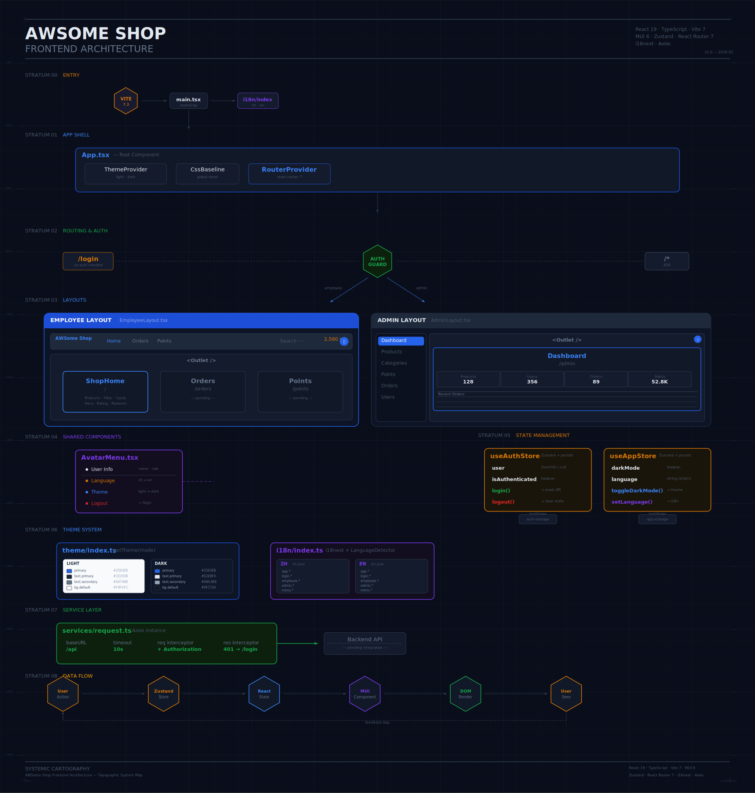

# AWSome Shop Frontend

员工积分兑换商城前端项目，基于 React 19 + TypeScript + Vite 7 + MUI 6 构建。

## 技术栈

| 类别 | 技术 | 版本 |
|------|------|------|
| 框架 | React | 19.2 |
| 语言 | TypeScript | 5.9 |
| 构建工具 | Vite | 7.3 |
| UI 组件库 | MUI (Material-UI) | 6.5 |
| 状态管理 | Zustand | 5.0 |
| 路由 | React Router | 7.13 |
| 国际化 | i18next | 25.8 |
| HTTP 客户端 | Axios | 1.13 |

## 架构总览

<p align="center">
  
</p>

## 项目结构

```
src/
├── components/
│   ├── AvatarMenu.tsx              # 头像下拉菜单（切换语言/主题/退出）
│   └── Layout/
│       ├── EmployeeLayout.tsx      # 员工端布局（顶部导航栏）
│       └── AdminLayout.tsx         # 管理端布局（侧边栏导航）
├── pages/
│   ├── Login/index.tsx             # 登录页
│   ├── ShopHome/index.tsx          # 员工商城首页
│   ├── Dashboard/index.tsx         # 管理员仪表盘
│   └── NotFound/index.tsx          # 404 页面
├── router/
│   ├── index.tsx                   # 路由配置
│   └── AuthGuard.tsx               # 路由守卫（角色鉴权）
├── store/
│   ├── useAuthStore.ts             # 认证状态（用户信息、登录/登出）
│   └── useAppStore.ts              # 应用状态（主题、语言偏好）
├── services/
│   └── request.ts                  # Axios 实例及拦截器
├── i18n/
│   ├── index.ts                    # i18next 配置
│   └── locales/
│       ├── zh.json                 # 中文翻译
│       └── en.json                 # 英文翻译
├── theme/
│   └── index.ts                    # MUI 主题工厂（亮色/暗色）
├── App.tsx                         # 根组件
└── main.tsx                        # 入口文件
```

## 快速开始

```bash
# 安装依赖
npm install

# 启动开发服务器
npm run dev

# 构建生产版本
npm run build

# 预览构建结果
npm run preview
```

## 测试账号

| 角色 | 用户名 | 密码 | 说明 |
|------|--------|------|------|
| 管理员 | admin | admin123 | 进入管理后台 /admin |
| 员工 | employee | emp123 | 进入商城首页 / |

> 当前使用前端 Mock 数据，后续接入后端 API 后替换。

## 功能特性

### 双角色系统

- **员工端**：商品浏览、分类筛选、积分兑换、兑换记录、积分中心
- **管理端**：数据仪表盘、商品管理、分类管理、积分管理、兑换记录、用户管理

### 路由与鉴权

```
/login          → 登录页（无需认证）
/               → 员工商城首页（需 employee 角色）
/orders         → 兑换记录（需 employee 角色）
/points         → 积分中心（需 employee 角色）
/admin          → 管理仪表盘（需 admin 角色）
/admin/products → 商品管理（需 admin 角色）
/admin/...      → 其他管理页面
```

- `AuthGuard` 组件进行角色校验，未登录跳转 `/login`，角色不匹配跳转到对应默认页面
- 认证状态通过 Zustand persist 中间件持久化到 localStorage

### 国际化 (i18n)

- 支持中文 (zh) 和英文 (en)
- 登录页始终跟随浏览器语言，不受用户偏好影响
- 登录后通过头像菜单切换语言，偏好持久化保存

### 主题切换

- 支持亮色 / 暗色两种主题
- 登录页始终使用亮色主题
- 通过头像菜单切换，偏好持久化保存

### 设计规范

| 属性 | 值 |
|------|------|
| 主色 | #2563EB |
| 文本主色（亮） | #1E293B |
| 文本次色（亮） | #64748B |
| 背景色（亮） | #F8FAFC |
| 背景色（暗） | #0F172A |
| 纸片色（暗） | #1E293B |
| 字体 | Inter, system fonts |
| 侧边栏宽度 | 240px |
| 顶部导航高度 | 64px |

## 状态管理

### useAuthStore

```typescript
// 认证状态
user: UserInfo | null       // 当前用户信息
isAuthenticated: boolean    // 是否已认证
login(username, password)   // 登录
logout()                    // 登出
```

### useAppStore

```typescript
// 应用全局状态
darkMode: boolean           // 暗色模式
language: string            // 语言偏好 ('zh' | 'en')
toggleDarkMode()            // 切换主题
setLanguage(lang)           // 设置语言
```

两个 Store 均通过 `zustand/middleware/persist` 持久化到 localStorage。

## 后续开发

- [ ] 接入后端 API，替换 Mock 数据
- [ ] 完成商品管理、分类管理等管理端 CRUD 页面
- [ ] 完成员工端兑换记录、积分中心页面
- [ ] 商品详情页与兑换流程
- [ ] 用户注册功能
- [ ] 响应式移动端适配
