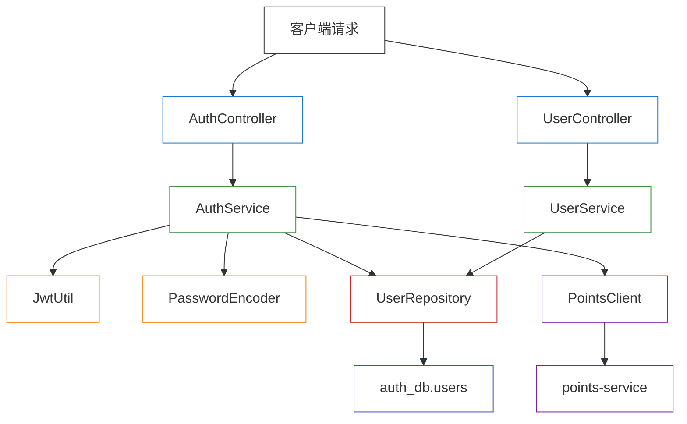

# Unit 2: auth-service — 逻辑组件

---

## 组件清单

| 组件 | 层级 | 职责 |
|------|------|------|
| AuthController | 控制器层 | 处理注册、登录、退出请求 |
| UserController | 控制器层 | 处理用户信息查询、管理员用户管理请求 |
| AuthService | 业务层 | 注册逻辑、登录逻辑、密码加密/校验 |
| UserService | 业务层 | 用户查询、用户状态管理 |
| JwtUtil | 工具层 | JWT 令牌生成 |
| PasswordEncoder | 工具层 | bcrypt 密码加密/校验 |
| PointsClient | 客户端层 | 调用 points-service 内部接口 |
| UserRepository | 数据访问层 | users 表 CRUD 操作 |
| GlobalExceptionHandler | 横切层 | 统一异常处理，错误码转换 |

---

## 目录结构（技术无关）

```
auth-service/
  src/
    controller/
      AuthController        # POST /api/auth/register, login, logout
      UserController         # GET /api/users/me, /api/admin/users/*
    service/
      AuthService            # 注册、登录业务逻辑
      UserService            # 用户查询、状态管理
    repository/
      UserRepository         # users 表数据访问
    model/
      User                   # 用户实体
      Role                   # 角色枚举
      UserStatus             # 账号状态枚举
    dto/
      RegisterRequest        # 注册请求
      LoginRequest           # 登录请求
      UpdateUserRequest      # 更新用户请求
      UserResponse           # 用户信息响应
      TokenResponse          # 登录令牌响应
      ErrorResponse          # 统一错误响应
    config/
      JwtConfig              # JWT 配置（密钥、过期时间）
    util/
      JwtUtil                # JWT 令牌生成工具
      PasswordEncoder        # bcrypt 密码工具
    client/
      PointsClient           # points-service HTTP 客户端
    exception/
      BusinessException      # 业务异常（含错误码）
      GlobalExceptionHandler # 全局异常处理器
```

---

## 组件交互图



---

## NFR 需求覆盖映射

| NFR 需求 | 对应设计模式/组件 |
|---------|-----------------|
| NFR-AUTH-001 密码加密存储 | PasswordEncoder (bcrypt) |
| NFR-AUTH-002 JWT 令牌安全 | JwtUtil + JwtConfig |
| NFR-AUTH-003 登录信息脱敏 | AuthService（统一错误码 AUTH_003） |
| NFR-AUTH-004 输入校验 | 分层校验模式（框架层+业务层+DB层） |
| NFR-AUTH-005 API 响应时间 | 无特殊组件，MVP 不做并发优化 |
| NFR-AUTH-006 分页查询性能 | UserRepository（利用数据库索引） |
| NFR-AUTH-007 跨服务调用容错 | PointsClient（3秒超时+降级） |
| NFR-AUTH-008 数据一致性 | DB UNIQUE 约束 |
| NFR-AUTH-009 统一错误响应 | GlobalExceptionHandler + ErrorResponse |
| NFR-AUTH-010 日志规范 | 遵循框架日志规范 |
| NFR-AUTH-011 配置外部化 | JwtConfig + 环境变量 |
| NFR-AUTH-012 单元测试 | 待框架确定后实现 |
| NFR-AUTH-013 API 测试 | 待框架确定后实现 |
