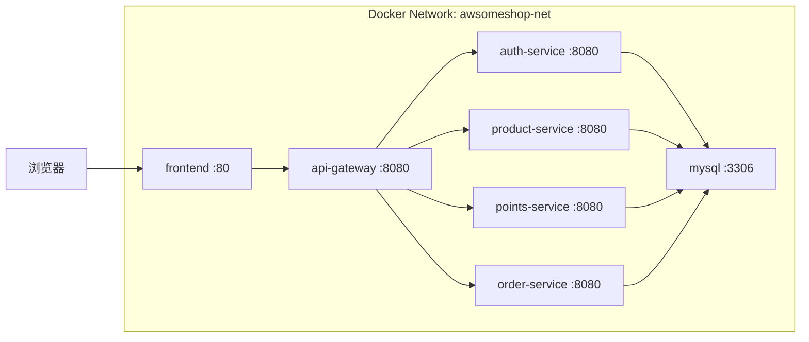

# Unit 7: infrastructure — Docker Compose 编排设计

## 服务清单

| 服务名 | 镜像/构建 | 内部端口 | 宿主机端口 | 依赖 |
|--------|----------|---------|-----------|------|
| mysql | mysql:8.0 | 3306 | 3306 | — |
| auth-service | build: ./auth-service | 8080 | — | mysql |
| product-service | build: ./product-service | 8080 | — | mysql |
| points-service | build: ./points-service | 8080 | — | mysql |
| order-service | build: ./order-service | 8080 | — | mysql |
| api-gateway | build: ./api-gateway | 8080 | 8080 | auth-service, product-service, points-service, order-service |
| frontend | build: ./awsomeshop-frontend | 80 | 80 | api-gateway |

> 仅 api-gateway (8080) 和 frontend (80) 暴露宿主机端口。MySQL (3306) 暴露用于开发调试。

---

## 网络拓扑



所有服务在同一个 Docker bridge 网络 `awsomeshop-net` 中，通过服务名进行 DNS 解析通信。

---

## 卷挂载

| 卷名 | 挂载路径 | 用途 |
|------|---------|------|
| mysql-data | /var/lib/mysql | MySQL 数据持久化 |
| product-uploads | /app/uploads | 产品图片存储 |

---

## MySQL 初始化

Docker Compose 中 MySQL 服务通过 `docker-entrypoint-initdb.d` 目录自动执行初始化脚本：

```
infrastructure/mysql/
  01-create-databases.sql    # 创建4个database和用户授权
  02-auth-schema.sql         # auth_db 建表
  03-product-schema.sql      # product_db 建表
  04-points-schema.sql       # points_db 建表
  05-order-schema.sql        # order_db 建表
  06-seed-data.sql           # 种子数据
```

脚本按文件名排序依次执行。

---

## 服务启动顺序

1. mysql — 数据库就绪
2. auth-service, product-service, points-service, order-service — 并行启动，等待 mysql 健康检查通过
3. api-gateway — 等待所有微服务就绪
4. frontend — 等待 api-gateway 就绪

通过 Docker Compose `depends_on` + `healthcheck` 控制启动顺序。
