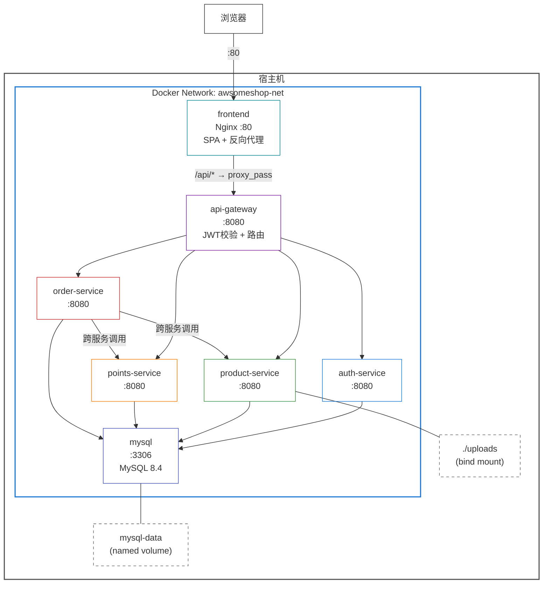
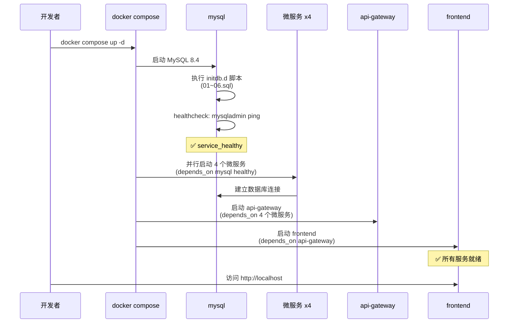

# Unit 7: infrastructure — 部署架构

---

## 1. 部署拓扑图



---

## 2. 端口映射

| 服务 | 容器端口 | 宿主机端口 | 访问方式 |
|------|---------|-----------|---------|
| frontend | 80 | 80 | 浏览器直接访问 `http://localhost` |
| api-gateway | 8080 | 8080 | 浏览器不直接访问（通过 Nginx 反向代理） |
| mysql | 3306 | 3306 | 开发工具连接（如 DBeaver、Navicat） |
| auth-service | 8080 | — | 仅 Docker 内部访问 |
| product-service | 8080 | — | 仅 Docker 内部访问 |
| points-service | 8080 | — | 仅 Docker 内部访问 |
| order-service | 8080 | — | 仅 Docker 内部访问 |

用户访问入口：`http://localhost`（前端 Nginx 统一处理页面和 API）

---

## 3. 卷映射

| 卷 | 类型 | 容器路径 | 宿主机路径 | 用途 |
|----|------|---------|-----------|------|
| mysql-data | named volume | /var/lib/mysql | Docker 管理 | MySQL 数据持久化 |
| uploads | bind mount | /app/uploads | ../uploads（项目根目录） | 产品图片存储 |
| nginx config | bind mount (ro) | /etc/nginx/conf.d/default.conf | ./nginx/default.conf | Nginx 配置 |
| mysql init | bind mount (ro) | /docker-entrypoint-initdb.d | ./mysql/ | 数据库初始化脚本 |

---

## 4. 启动流程



---

## 5. 请求流转路径

```
浏览器
  │
  ▼ http://localhost (port 80)
frontend (Nginx)
  │
  ├── 静态资源 → 直接返回 (HTML/JS/CSS/图片)
  ├── SPA 路由 → /index.html
  └── /api/* → proxy_pass http://api-gateway:8080
          │
          ▼
      api-gateway
          │
          ├── JWT 校验（公开端点放行）
          ├── 角色权限校验（/api/admin/* 需要 ADMIN）
          └── 路由转发：
              ├── /api/auth/*     → auth-service:8080
              ├── /api/users/*    → auth-service:8080
              ├── /api/products/* → product-service:8080
              ├── /api/categories/* → product-service:8080
              ├── /api/files/*    → product-service:8080
              ├── /api/points/*   → points-service:8080
              ├── /api/orders/*   → order-service:8080
              └── /api/admin/*    → 对应微服务
```

---

## 6. 开发常用命令

```bash
# 进入 infrastructure 目录
cd infrastructure

# 首次启动（构建镜像 + 启动）
docker compose up -d --build

# 查看所有服务状态
docker compose ps

# 查看某个服务日志
docker compose logs -f api-gateway

# 停止所有服务
docker compose down

# 停止并清除数据（重新初始化数据库）
docker compose down -v

# 仅重建某个服务
docker compose up -d --build auth-service
```

---

## 7. .gitignore 规则

```gitignore
# 环境变量（包含敏感信息）
infrastructure/.env

# 上传文件目录
uploads/

# Docker 相关
*.log
```
