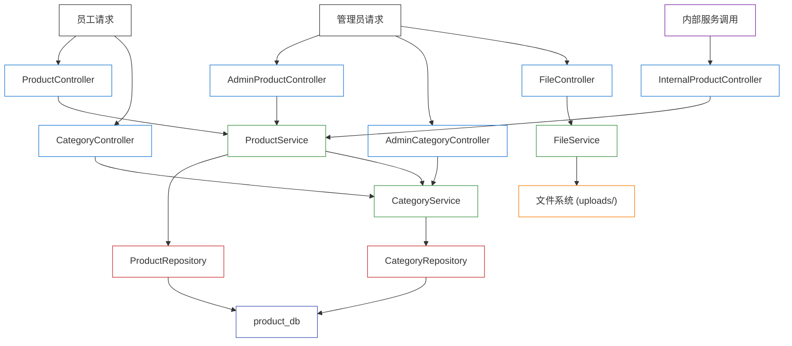

# Unit 3: product-service — 逻辑组件

---

## 组件清单

| 组件 | 层级 | 职责 |
|------|------|------|
| ProductController | 控制器层 | 处理员工端产品列表、详情请求 |
| AdminProductController | 控制器层 | 处理管理员产品 CRUD 请求 |
| CategoryController | 控制器层 | 处理分类树查询请求 |
| AdminCategoryController | 控制器层 | 处理管理员分类 CRUD 请求 |
| FileController | 控制器层 | 处理文件上传和访问请求 |
| InternalProductController | 控制器层 | 处理内部接口（产品查询、库存扣减/恢复） |
| ProductService | 业务层 | 产品 CRUD 业务逻辑、库存扣减/恢复 |
| CategoryService | 业务层 | 分类 CRUD 业务逻辑、分类树构建 |
| FileService | 业务层 | 文件上传校验、UUID 重命名、文件读取 |
| ProductRepository | 数据访问层 | products 表 CRUD 操作、悲观锁查询 |
| CategoryRepository | 数据访问层 | categories 表 CRUD 操作 |
| GlobalExceptionHandler | 横切层 | 统一异常处理，错误码转换 |

---

## 目录结构（技术无关）

```
product-service/
  src/
    controller/
      ProductController          # GET /api/products, /api/products/{id}
      AdminProductController     # POST/PUT/DELETE/GET /api/admin/products/*
      CategoryController         # GET /api/categories/tree
      AdminCategoryController    # POST/PUT/DELETE /api/admin/categories/*
      FileController             # POST /api/files/upload, GET /api/files/{filename}
      InternalProductController  # GET/POST /api/internal/products/*
    service/
      ProductService             # 产品 CRUD、库存扣减/恢复
      CategoryService            # 分类 CRUD、分类树构建
      FileService                # 文件上传校验、存储、读取
    repository/
      ProductRepository          # products 表数据访问
      CategoryRepository         # categories 表数据访问
    model/
      Product                    # 产品实体
      Category                   # 分类实体
      ProductStatus              # 产品状态枚举
    dto/
      CreateProductRequest       # 创建产品请求
      UpdateProductRequest       # 更新产品请求
      CreateCategoryRequest      # 创建分类请求
      UpdateCategoryRequest      # 更新分类请求
      StockDeductRequest         # 库存扣减请求（内部接口）
      ProductResponse            # 产品信息响应
      CategoryResponse           # 分类信息响应
      CategoryTreeNode           # 分类树节点
      FileResponse               # 文件上传响应
      PageResponse               # 分页响应（通用）
      ErrorResponse              # 统一错误响应
    config/
      FileConfig                 # 文件上传配置（UPLOAD_DIR, MAX_FILE_SIZE）
    exception/
      BusinessException          # 业务异常（含错误码）
      GlobalExceptionHandler     # 全局异常处理器
  uploads/                       # 图片存储目录（Docker 卷挂载）
```

---

## 组件交互图



---

## NFR 需求覆盖映射

| NFR 需求 | 对应设计模式/组件 |
|---------|-----------------|
| NFR-PROD-001 输入校验 | 分层输入校验模式（框架层+业务层+DB层） |
| NFR-PROD-002 文件上传安全 | FileService（白名单+UUID重命名+大小限制） |
| NFR-PROD-003 内部接口安全 | 内部接口隔离模式（Docker网络+路径前缀） |
| NFR-PROD-004 API 响应时间 | 数据库索引 + 分页查询 |
| NFR-PROD-005 分页查询性能 | ProductRepository（索引+分页上限100） |
| NFR-PROD-006 库存扣减性能 | 悲观锁库存控制模式（5秒超时+快速失败） |
| NFR-PROD-007 图片访问性能 | 图片缓存模式（Cache-Control 24h） |
| NFR-PROD-008 数据一致性 | 悲观锁 + 软删除 + 分类删除前置条件 |
| NFR-PROD-009 文件存储可靠性 | Docker 卷挂载 + 软删除不删图片 |
| NFR-PROD-010 统一错误响应 | GlobalExceptionHandler + ErrorResponse |
| NFR-PROD-011 日志规范 | 遵循后端框架日志规范 |
| NFR-PROD-012 配置外部化 | FileConfig + 环境变量 |
| NFR-PROD-013 单元测试 | 待框架确定后实现 |
| NFR-PROD-014 API 测试 | 待框架确定后实现 |
