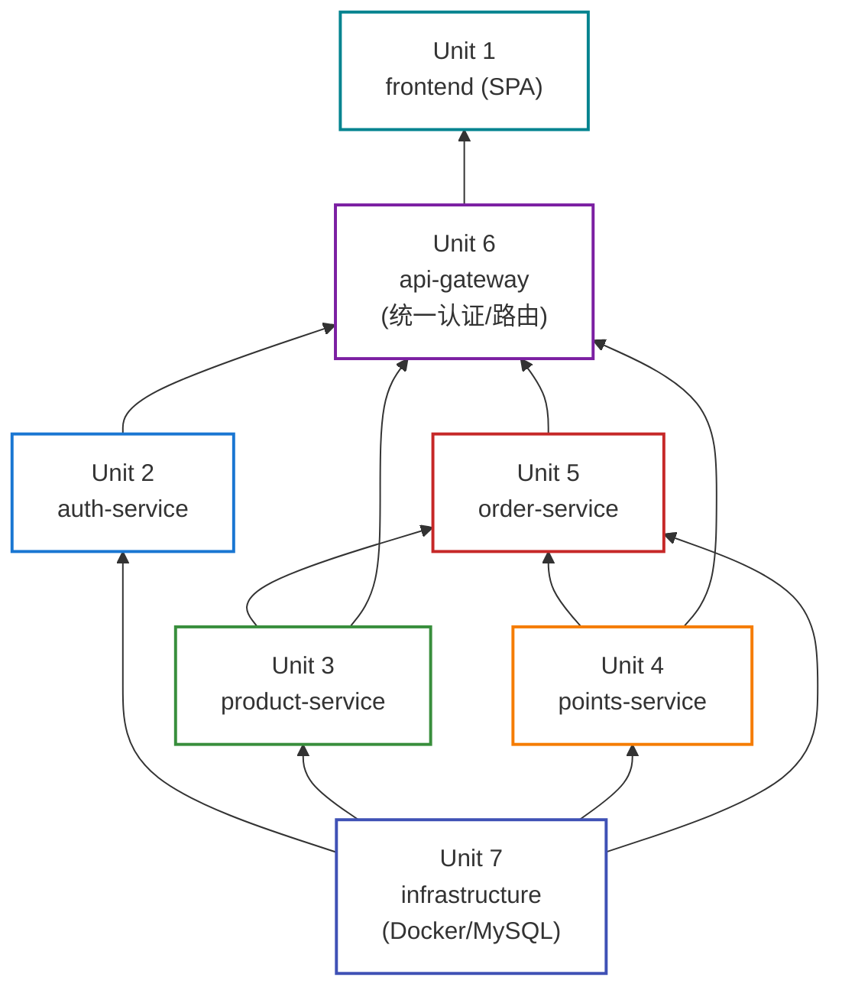
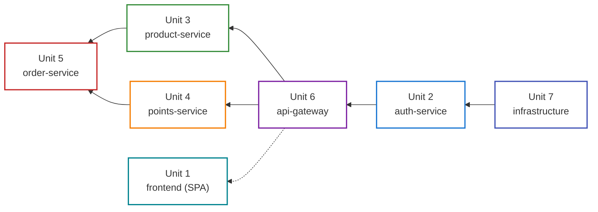

# AWSomeShop 工作单元依赖关系

---

## 依赖矩阵

| 单元 | 依赖于 | 被依赖于 |
|------|--------|---------|
| Unit 1 (frontend) | Unit 6（通过 API 网关访问所有后端服务） | — |
| Unit 2 (auth-service) | Unit 7（数据库） | Unit 6（JWT 签名密钥共享）、Unit 5（用户信息查询） |
| Unit 3 (product-service) | Unit 7（数据库） | Unit 5（产品查询/库存扣减） |
| Unit 4 (points-service) | Unit 7（数据库） | Unit 5（积分查询/扣除） |
| Unit 5 (order-service) | Unit 3, 4, 7（跨服务调用 + 数据库） | — |
| Unit 6 (api-gateway) | Unit 2（JWT 签名密钥共享）、Unit 2-5（请求转发目标） | Unit 1（统一入口） |
| Unit 7 (infrastructure) | — | Unit 2, 3, 4, 5（数据库 + 运行环境） |

---

## 依赖图

---

## 建议开发顺序

### 阶段 1：基础设施（Unit 7）
- Docker Compose 编排
- MySQL 数据库初始化
- 环境配置
- **理由**: 所有服务的运行基础

### 阶段 2：认证服务（Unit 2）
- 用户注册/登录
- JWT 令牌生成
- **理由**: API 网关需要 JWT 签名密钥，其他服务需要用户体系

### 阶段 3：API 网关（Unit 6）
- JWT 令牌校验
- 角色权限校验
- 请求路由转发
- **理由**: 所有前端请求通过网关访问后端，需要尽早就绪

### 阶段 4：产品服务 + 积分服务（Unit 3 + Unit 4，可并行）
- 产品 CRUD、分类管理、图片上传
- 积分管理、自动发放
- **理由**: 两者互不依赖，可并行开发

### 阶段 5：兑换服务（Unit 5）
- 兑换流程（依赖产品服务和积分服务）
- **理由**: 需要调用产品和积分服务

### 阶段 6：前端应用（Unit 1）
- 可在阶段 3 完成后逐步开发
- 先开发认证页面，再开发产品浏览，最后开发管理后台
- **理由**: 前端通过 API 网关对接，按后端 API 就绪顺序逐步集成

---

## 关键路径

- **关键路径时长**: Unit 7 + Unit 2 + Unit 6 + Unit 3(或4) + Unit 5
- **并行机会**: Unit 3 和 Unit 4 可并行；Unit 1 可与后端并行开发
