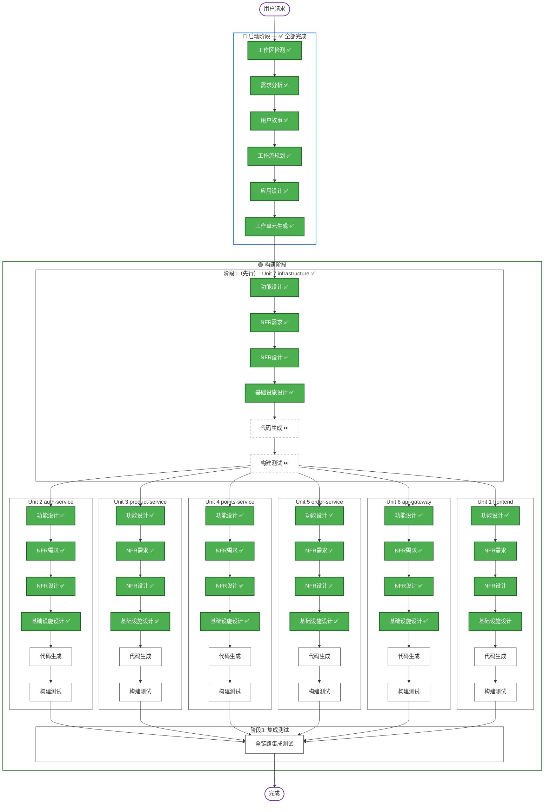

# AWSomeShop 执行计划

## 详细分析摘要

### 变更影响评估
- **用户界面变更**: 是 — 全新的前端界面（员工端 + 管理端）
- **结构变更**: 是 — 全新的前后端分离架构
- **数据模型变更**: 是 — 全新的数据库设计（用户、产品、分类、积分、兑换记录）
- **API 变更**: 是 — 全新的 RESTful API 设计
- **NFR 影响**: 是 — 安全认证、Docker 部署、性能考量

### 风险评估
- **风险级别**: 中等
- **回滚复杂度**: 低（全新项目，无历史包袱）
- **测试复杂度**: 中等（多模块集成测试）

## 工作流可视化



### 文本替代方案
```
启动阶段: ✅ 全部完成
  ✅ 工作区检测 → ✅ 需求分析 → ✅ 用户故事 → ✅ 工作流规划 → ✅ 应用设计 → ✅ 工作单元生成

构建阶段: ⏳ 进行中
  阶段1（先行）: Unit 7 (infrastructure) — 功能设计 → NFR需求 → NFR设计 → 基础设施设计 → 代码生成 → 构建测试
  阶段2（并行）: Unit 2/3/4/5/6 + Unit 1 — 各自 功能设计 → NFR需求 → NFR设计 → 基础设施设计 → 代码生成 → 构建测试
  阶段3: 全链路集成测试
```

---

## 阶段执行计划

### 🔵 启动阶段 (INCEPTION) — ✅ 全部完成
- [x] 工作区检测 — 已完成
- [x] 需求分析 — 已完成
- [x] 用户故事 — 已完成（25个故事，3个用户画像）
- [x] 工作流规划 — 已完成
- [x] 应用设计 — 已完成（组件、方法、服务、依赖关系）
- [x] 工作单元生成 — 已完成（7个工作单元：前端SPA + 4个微服务 + API网关 + 基础设施）

### 🟢 构建阶段 (CONSTRUCTION) — ⏳ 进行中

#### 阶段 1（先行）: Unit 7 — infrastructure ✅
- [x] 功能设计
- [x] NFR需求
- [x] NFR设计
- [x] 基础设施设计
- [x] 代码生成 — ⏭️ 跳过（用户选择先完成所有 Unit 设计）
- [x] 构建和测试 — ⏭️ 跳过（用户选择先完成所有 Unit 设计）

#### 阶段 2（并行）: Unit 2/3/4/5/6 + Unit 1

Unit 2 (auth-service):
- [x] 功能设计
- [x] NFR需求
- [x] NFR设计
- [x] 基础设施设计
- [ ] 代码生成
- [ ] 构建和测试

Unit 3 (product-service):
- [x] 功能设计
- [x] NFR需求
- [x] NFR设计
- [x] 基础设施设计
- [ ] 代码生成
- [ ] 构建和测试

Unit 4 (points-service):
- [x] 功能设计
- [x] NFR需求
- [x] NFR设计
- [x] 基础设施设计
- [ ] 代码生成
- [ ] 构建和测试

Unit 5 (order-service):
- [x] 功能设计
- [x] NFR需求
- [x] NFR设计
- [x] 基础设施设计
- [ ] 代码生成
- [ ] 构建和测试

Unit 6 (api-gateway):
- [x] 功能设计
- [x] NFR需求
- [x] NFR设计
- [x] 基础设施设计
- [ ] 代码生成
- [ ] 构建和测试

Unit 1 (awsomeshop-frontend):
- [x] 功能设计
- [x] NFR需求
- [x] NFR设计
- [x] 基础设施设计
- [ ] 代码生成
- [ ] 构建和测试

#### 阶段 3: 集成测试
- [ ] 全链路集成测试

### 🟡 运维阶段 (OPERATIONS)
- [ ] 运维 — 占位（未来扩展）

---

## 成功标准
- **主要目标**: 交付可运行的 AWSomeShop MVP，验证员工积分兑换商业模式
- **关键交付物**:
  - 前后端分离的 Web 应用
  - MySQL 数据库及初始化脚本
  - Docker 容器化部署配置
  - API 文档
  - 单元测试
- **质量门禁**:
  - 所有 Must Have 用户故事的验收标准通过
  - 安全认证机制正常工作
  - Docker 一键启动成功
