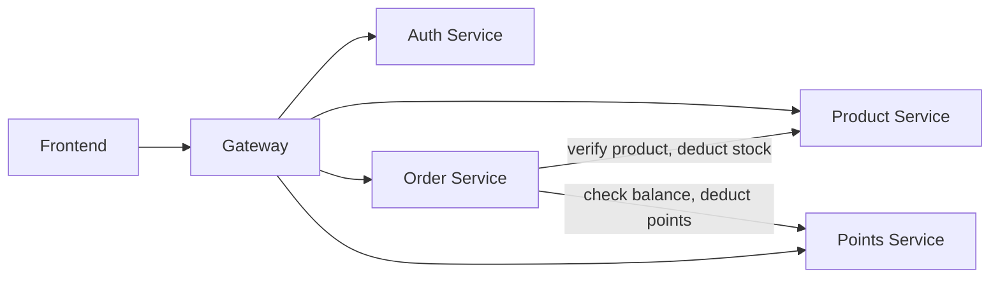

# Component Dependency Relationships

## Dependency Matrix



- **Auth Service** → standalone (no outbound service calls)
- **Product Service** → standalone (no outbound service calls)
- **Points Service** → standalone (no outbound service calls)

## Intra-Service Dependencies (DDD Layers)

```
Controller → ApplicationService → DomainService → Repository/Cache/MQ/Security (ports)
```

Infrastructure adapters implement port interfaces.

## Data Flow — Key Scenarios

### 1. Login

```
Frontend → Gateway (skip auth) → Auth Controller → AuthAppService
  → UserDomainService + TokenService → Response
```

### 2. Browse Products

```
Frontend → Gateway (skip auth, public) → Product Controller → ProductAppService
  → ProductDomainService → ProductRepository → Response
```

### 3. Create Redemption Order

```
Frontend → Gateway (auth + inject operatorId) → Order Controller → OrderAppService
  → [validate: call Product via HTTP]
  → [validate: call Points via HTTP]
  → OrderDomainService → OrderRepository → Response
```

### 4. Confirm Order

```
Admin Frontend → Gateway → Order Controller → OrderAppService
  → [deduct points: call Points via HTTP]
  → [deduct stock: call Product via HTTP]
  → OrderDomainService.confirm() → Response
```
