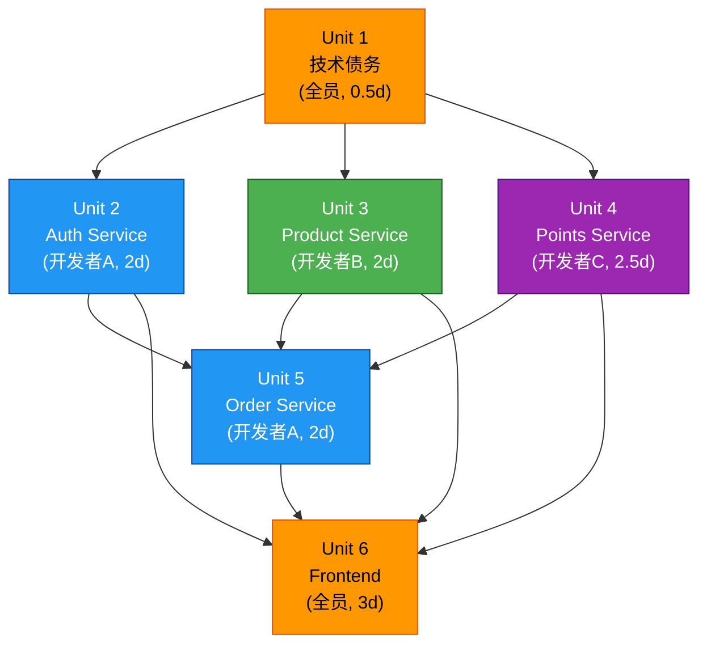

# 工作单元依赖矩阵

## 依赖关系图

## 依赖矩阵

| 单元 | 依赖于 | 被依赖于 | 阻塞等级 |
|------|--------|----------|----------|
| Unit 1 技术债务 | 无 | Unit 2, 3, 4 | 关键（阻塞所有后端） |
| Unit 2 Auth | Unit 1 | Unit 5, 6 | 关键（阻塞订单和前端登录） |
| Unit 3 Product | Unit 1 | Unit 5, 6 | 关键（阻塞订单和前端商品） |
| Unit 4 Points | Unit 1 | Unit 5, 6 | 关键（阻塞订单和前端积分） |
| Unit 5 Order | Unit 2, 3, 4 | Unit 6 | 中等（仅阻塞前端订单页） |
| Unit 6 Frontend | Unit 2, 3, 4, 5 | 无 | 无（终端单元） |

## 并行机会

- **可并行**: Unit 2 + Unit 3 + Unit 4（技术债务完成后同时开发）
- **串行**: Unit 5 必须等待 Unit 2, 3, 4 完成
- **部分并行**: Unit 6 的基础框架（API Service 模块、路由配置）可在后端完成前开始

## 跨单元接口契约

| 调用方 | 被调用方 | 接口 | 用途 |
|--------|----------|------|------|
| Gateway | Auth Service | POST /api/v1/internal/auth/validate | Token 验证 |
| Order Service | Product Service | POST /api/v1/public/product/get | 验证商品 |
| Order Service | Product Service | POST /api/v1/product/deduct-stock | 扣减库存 |
| Order Service | Points Service | POST /api/v1/point/balance | 查询余额 |
| Order Service | Points Service | POST /api/v1/point/deduct | 扣减积分 |
