# 执行计划

## 详细分析摘要

### 变更范围
- **变更类型**: 系统级新功能开发（4 个后端服务 + 前端）
- **主要变更**: 将 4 个 Test 占位服务替换为真实业务逻辑，开发 10+ 前端页面，对接 API
- **相关组件**: auth-service, product-service, order-service, points-service, gateway-service, frontend

### 变更影响评估
- **用户界面变更**: 是 — 10+ 新页面，Mock 数据替换为真实 API
- **架构变更**: 否 — 沿用现有 DDD 六边形架构
- **数据模型变更**: 是 — 新增 user/role/product/category/order/points 等表
- **API 变更**: 是 — 新增 25+ API 端点（POST-only 风格）
- **NFR 影响**: 低 — 沿用现有技术栈和配置

### 组件依赖关系
```
Frontend → Gateway → Auth Service (认证)
                   → Product Service (商品)
                   → Order Service (订单)
                   → Points Service (积分)

Order Service → Product Service (验证商品，经 Gateway)
Order Service → Points Service (扣减积分，经 Gateway)
```

### 风险评估
- **风险等级**: 中等
- **回滚复杂度**: 低（每个服务独立部署，Flyway 支持版本化迁移）
- **测试复杂度**: 中等（跨服务交互需要集成测试）

---

## 工作流可视化

```mermaid
flowchart TD
    Start(["用户请求"])
    
    subgraph INCEPTION["🔵 INCEPTION 阶段"]
        WD["工作区检测<br/><b>已完成</b>"]
        RE["逆向工程<br/><b>已完成</b>"]
        RA["需求分析<br/><b>已完成</b>"]
        US["用户故事<br/><b>已完成</b>"]
        WP["工作流规划<br/><b>进行中</b>"]
        AD["应用设计<br/><b>执行</b>"]
        UG["工作单元生成<br/><b>执行</b>"]
    end
    
    subgraph CONSTRUCTION["🟢 CONSTRUCTION 阶段"]
        FD["功能设计<br/><b>执行（每单元）</b>"]
        CG["代码生成<br/><b>执行（每单元）</b>"]
        BT["构建与测试<br/><b>执行</b>"]
    end
    
    Start --> WD
    WD --> RE --> RA --> US --> WP
    WP --> AD --> UG
    UG --> FD
    FD --> CG
    CG -.->|下一单元| FD
    CG --> BT
    BT --> End(["完成"])
    
    style WD fill:#4CAF50,stroke:#1B5E20,stroke-width:3px,color:#fff
    style RE fill:#4CAF50,stroke:#1B5E20,stroke-width:3px,color:#fff
    style RA fill:#4CAF50,stroke:#1B5E20,stroke-width:3px,color:#fff
    style US fill:#4CAF50,stroke:#1B5E20,stroke-width:3px,color:#fff
    style WP fill:#4CAF50,stroke:#1B5E20,stroke-width:3px,color:#fff
    style AD fill:#FFA726,stroke:#E65100,stroke-width:3px,stroke-dasharray: 5 5,color:#000
    style UG fill:#FFA726,stroke:#E65100,stroke-width:3px,stroke-dasharray: 5 5,color:#000
    style FD fill:#FFA726,stroke:#E65100,stroke-width:3px,stroke-dasharray: 5 5,color:#000
    style CG fill:#4CAF50,stroke:#1B5E20,stroke-width:3px,color:#fff
    style BT fill:#4CAF50,stroke:#1B5E20,stroke-width:3px,color:#fff
    style INCEPTION fill:#BBDEFB,stroke:#1565C0,stroke-width:3px,color:#000
    style CONSTRUCTION fill:#C8E6C9,stroke:#2E7D32,stroke-width:3px,color:#000
    style Start fill:#CE93D8,stroke:#6A1B9A,stroke-width:3px,color:#000
    style End fill:#CE93D8,stroke:#6A1B9A,stroke-width:3px,color:#000
    linkStyle default stroke:#333,stroke-width:2px
```



**图例**: 🟢 绿色=已完成/必须执行 | 🟠 橙色=条件执行 | ⬜ 灰色=跳过

---

## 阶段执行计划

### 🔵 INCEPTION 阶段
- [x] 工作区检测 (已完成)
- [x] 逆向工程 (已完成)
- [x] 需求分析 (已完成)
- [x] 用户故事 (已完成)
- [x] 工作流规划 (进行中)
- [ ] **应用设计 — 执行**
  - **理由**: 4 个业务服务需要定义领域模型、领域服务、应用服务、仓储接口等组件及其方法
- [ ] **工作单元生成 — 执行**
  - **理由**: 24 个故事需要分解为可由 3 人团队并行开发的工作单元

### 🟢 CONSTRUCTION 阶段（每单元循环）
- [ ] **功能设计 — 执行（每单元）**
  - **理由**: 每个单元需要详细的数据模型、业务规则和 API 设计
- [ ] NFR 需求 — **跳过**
  - **理由**: 技术栈已确定（Java 21/Spring Boot/MyBatis-Plus/Redis），NFR 需求在需求文档中已明确，无需单独阶段
- [ ] NFR 设计 — **跳过**
  - **理由**: 无复杂 NFR 模式需要设计，沿用现有基础设施配置
- [ ] Infrastructure 设计 — **跳过**
  - **理由**: 基础设施已存在（MySQL/Redis/SQS 配置齐全），无新基础设施需求
- [ ] **代码生成 — 执行（每单元，必须）**
  - **理由**: 每个单元需要生成代码
- [ ] **构建与测试 — 执行（必须）**
  - **理由**: 所有单元完成后统一构建和测试

### 🟡 OPERATIONS 阶段
- [ ] Operations — 占位（未来扩展）

---

## 模块更新顺序

基于依赖关系，推荐以下开发顺序：

```
阶段 1: 技术债务 + Auth Service（基础依赖）
  ├── 统一 Result 类（所有服务依赖）
  ├── 清理占位代码（所有服务）
  ├── Auth 领域模型 + 服务 + API
  └── Auth Flyway 迁移

阶段 2: Product Service + Points Service（可并行）
  ├── Product 领域模型 + 服务 + API + Flyway
  └── Points 领域模型 + 服务 + API + Flyway

阶段 3: Order Service（依赖 Product + Points）
  └── Order 领域模型 + 服务 + API + Flyway（含跨服务调用）

阶段 4: Frontend（依赖所有后端 API）
  ├── API Service 模块
  ├── 员工端页面（注册、详情、兑换记录、积分中心）
  ├── 管理端页面（商品、分类、积分、订单、用户）
  └── Dashboard + ShopHome 对接真实 API

阶段 5: Gateway 修复 + AOP + 集成测试
  ├── 修复 Gateway ThreadLocal
  ├── 实现 @RequireOwnerPermission AOP
  └── 跨服务集成测试
```

---

## 成功标准
- **主要目标**: 所有 24 个用户故事的验收标准全部通过
- **关键交付物**: 4 个可运行的后端服务 + 完整前端 + Flyway 迁移 + 单元/集成测试
- **质量门禁**: 编译通过、单元测试通过、集成测试通过、核心业务逻辑测试覆盖率 > 70%
