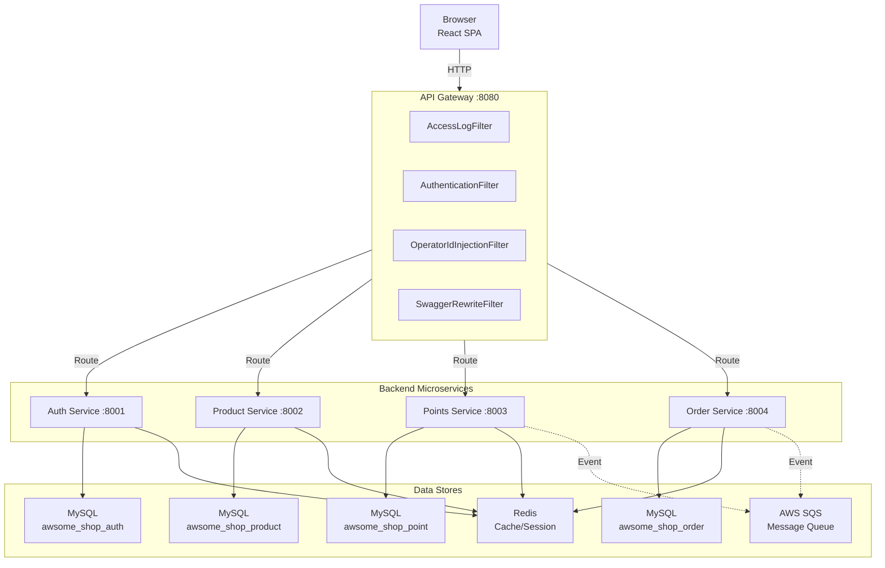
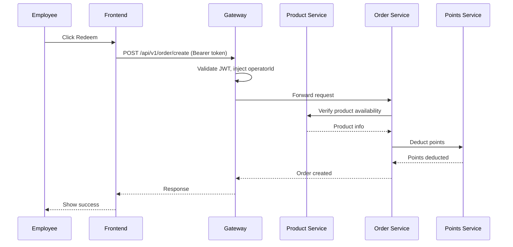
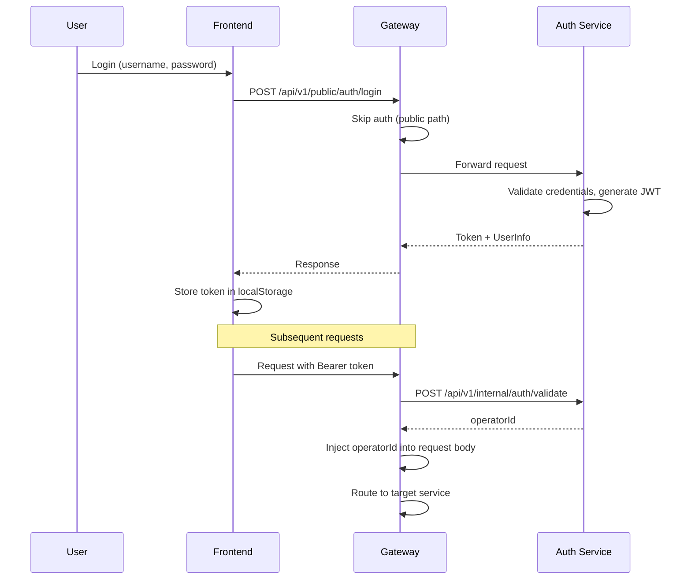

# System Architecture

## System Overview

AWSome Shop 是一个基于微服务架构的员工积分兑换商城。系统采用前后端分离架构，后端由 5 个 Spring Boot 微服务组成，通过 API Gateway 统一对外暴露。每个微服务遵循 DDD + 六边形架构，使用多模块 Maven 项目组织代码。

## Architecture Diagram

## Component Descriptions

### API Gateway (awsome-shop-gateway-service)
- **Purpose**: 统一 API 入口，请求路由与认证
- **Responsibilities**: JWT 认证、operatorId 注入、请求路由、Swagger 聚合、访问日志
- **Dependencies**: Auth Service (token 验证)
- **Type**: Application (Spring Cloud Gateway, WebFlux)

### Auth Service (awsome-shop-auth-service)
- **Purpose**: 用户认证与授权
- **Responsibilities**: 登录、注册、JWT 生成/验证、密码加密
- **Dependencies**: MySQL, Redis
- **Type**: Application (Spring Boot, Servlet)

### Product Service (awsome-shop-product-service)
- **Purpose**: 商品与分类管理
- **Responsibilities**: 商品 CRUD、分类 CRUD、搜索筛选
- **Dependencies**: MySQL, Redis
- **Type**: Application (Spring Boot, Servlet)

### Order Service (awsome-shop-order-service)
- **Purpose**: 兑换订单处理
- **Responsibilities**: 订单创建、状态流转、订单查询
- **Dependencies**: MySQL, Redis, SQS (planned)
- **Type**: Application (Spring Boot, Servlet)

### Points Service (awsome-shop-points-service)
- **Purpose**: 积分管理
- **Responsibilities**: 积分余额、发放、扣减、历史、统计
- **Dependencies**: MySQL, Redis, SQS (planned)
- **Type**: Application (Spring Boot, Servlet)

### Frontend SPA (awsome-shop-frontend)
- **Purpose**: 用户界面
- **Responsibilities**: 员工端商城、管理端后台、国际化、主题切换
- **Dependencies**: API Gateway
- **Type**: Application (React SPA)

## Data Flow

### 兑换流程 (Redemption Flow)

### 认证流程 (Authentication Flow)

## Integration Points

- **External APIs**: None (self-contained system)
- **Databases**: MySQL 8.4 (per-service database isolation)
- **Cache**: Redis (shared instance, per-service key namespace)
- **Message Queue**: AWS SQS (planned, for inter-service async events)
- **API Documentation**: SpringDoc OpenAPI, aggregated via Gateway Swagger UI

## Infrastructure Components

- **Gateway**: Spring Cloud Gateway (WebFlux, reactive)
- **Service Discovery**: Direct URL routing (no Eureka/Consul)
- **Deployment Model**: Docker Compose (local), per-service JAR
- **Database Migration**: Flyway (per-service)
- **Monitoring**: Micrometer Tracing + Prometheus metrics + Actuator endpoints
- **Logging**: Logstash Logback Encoder (JSON format for non-local profiles)
