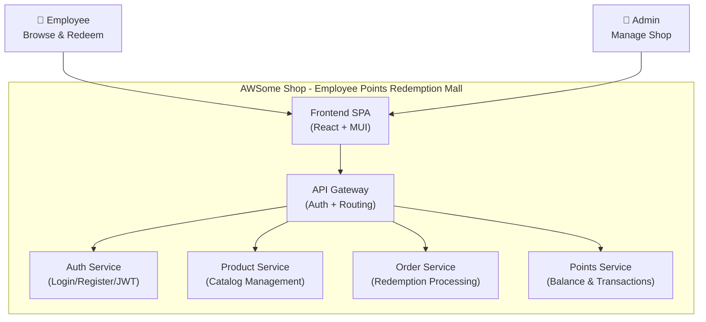

# Business Overview

## Business Context Diagram

## Business Description

- **Business Description**: AWSome Shop 是一个企业内部员工积分兑换商城系统。企业为员工发放积分作为奖励，员工可以使用积分在商城中兑换商品（数码电子、生活家居、美食餐饮、礼品卡券、办公用品等）。系统分为员工端和管理端，员工端提供商品浏览、积分兑换、兑换记录查询等功能；管理端提供商品管理、分类管理、积分管理、订单管理、用户管理和数据仪表盘等功能。

- **Business Transactions**:
  1. **用户注册** — 新员工注册账号，获得初始积分
  2. **用户登录/登出** — JWT 认证，支持双角色（employee/admin）
  3. **商品浏览** — 员工按分类筛选、搜索商品，查看商品详情
  4. **积分兑换** — 员工使用积分兑换商品，生成兑换订单，扣减积分
  5. **兑换记录查询** — 员工查看自己的兑换历史
  6. **积分查询** — 员工查看积分余额和积分变动历史
  7. **商品管理** — 管理员 CRUD 商品信息（名称、分类、积分价格、库存等）
  8. **分类管理** — 管理员 CRUD 商品分类
  9. **积分管理** — 管理员为员工发放积分，查看积分流通统计
  10. **订单管理** — 管理员查看所有兑换订单，更新订单状态（pending → processing → completed）
  11. **用户管理** — 管理员查看、编辑用户信息
  12. **数据仪表盘** — 管理员查看商品总数、用户总数、月度兑换量、积分流通量等统计

- **Business Dictionary**:
  | 术语 | 含义 |
  |------|------|
  | 积分 (Points) | 企业发放给员工的虚拟货币，用于兑换商品 |
  | 兑换 (Redemption) | 员工使用积分换取商品的行为 |
  | 兑换订单 (Order) | 一次兑换行为的记录，包含状态流转 |
  | 商品 (Product) | 可供兑换的物品或服务 |
  | 分类 (Category) | 商品的分组标签 |
  | 员工端 (Employee Portal) | 面向普通员工的商城界面 |
  | 管理端 (Admin Portal) | 面向管理员的后台管理界面 |
  | 积分流通量 (Points Circulation) | 一段时间内发放的积分总量 |

## Component Level Business Descriptions

### API Gateway (awsome-shop-gateway-service)
- **Purpose**: 统一入口，路由请求到后端微服务，处理 JWT 认证和操作者 ID 注入
- **Responsibilities**: 请求路由、JWT Token 验证、operatorId 注入到请求体、Swagger 文档聚合、访问日志、CORS 处理

### Auth Service (awsome-shop-auth-service)
- **Purpose**: 用户认证与授权服务
- **Responsibilities**: 用户注册、登录、JWT Token 生成与验证、密码加密、会话管理

### Product Service (awsome-shop-product-service)
- **Purpose**: 商品目录管理服务
- **Responsibilities**: 商品 CRUD、分类 CRUD、商品搜索与筛选、库存管理

### Order Service (awsome-shop-order-service)
- **Purpose**: 兑换订单处理服务
- **Responsibilities**: 创建兑换订单、订单状态流转、订单查询（员工/管理员视角）

### Points Service (awsome-shop-points-service)
- **Purpose**: 积分管理服务
- **Responsibilities**: 积分余额查询、积分发放、积分扣减、积分变动历史、积分统计

### Frontend SPA (awsome-shop-frontend)
- **Purpose**: 单页应用前端，提供员工端和管理端界面
- **Responsibilities**: 用户交互、页面路由、状态管理、国际化、主题切换、API 调用
