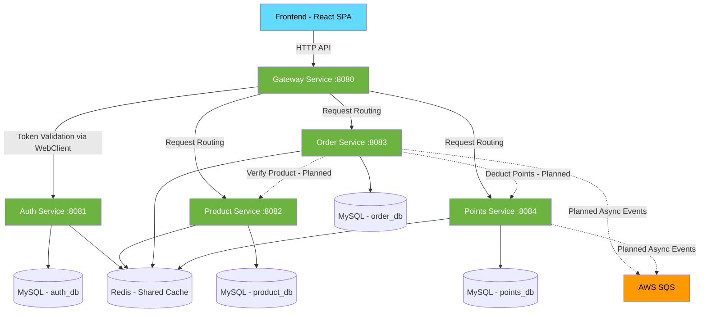

# Dependencies Analysis

## Internal Dependencies

**Legend**: Solid lines = implemented, Dashed lines = planned/not yet implemented

## External Dependencies

### Backend (Java/Spring Boot)

| Dependency | Purpose |
|---|---|
| Spring Boot 3.x | Application framework |
| Spring Cloud Gateway | API gateway (reactive) |
| MyBatis-Plus | ORM / data access |
| Druid | Connection pooling |
| MySQL Connector | Database driver |
| Lettuce Redis | Redis client (reactive-compatible) |
| AWS SQS SDK | Async messaging (planned) |
| jjwt | JWT library (declared, unused) |
| Flyway | Database migration |
| Lombok | Boilerplate reduction |
| SpringDoc | OpenAPI/Swagger documentation |
| Micrometer | Metrics/observability |
| Logstash Logback Encoder | Structured logging |
| JaCoCo | Code coverage reporting |
| TestContainers | Integration test infrastructure |

### Frontend (TypeScript/React)

| Dependency | Purpose |
|---|---|
| React | UI framework |
| MUI (Material UI) | Component library |
| Zustand | State management |
| Axios | HTTP client |
| i18next | Internationalization |
| Vite | Build tool / dev server |
